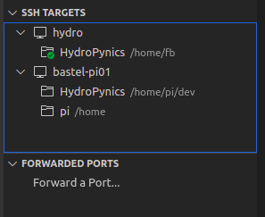

# cpp-vscode-guide <!-- omit in toc -->

A guide for useful extensions and configuration examples to unleash the power of Visual Studio Code for C/C++ development. And damn, it's becoming better and better. With the use of extensions it's a really great tool that supports your everyday developing.

# Table of contents <!-- omit in toc -->

- [1. About the project](#1-about-the-project)
- [2. Getting started](#2-getting-started)
  - [2.1. Installing VS Code](#21-installing-vs-code)
  - [2.2. C/C++ Extension](#22-cc-extension)
  - [2.3. Additional references](#23-additional-references)
- [3. CMake](#3-cmake)
- [4. Testing](#4-testing)
- [5. Docker](#5-docker)
- [6. Documentation](#6-documentation)
- [7. Remote development](#7-remote-development)
  - [7.1. Remote SSH Extension](#71-remote-ssh-extension)
  - [7.2. References](#72-references)
- [8. Static analysis](#8-static-analysis)
- [9. Code formatting & cleanup](#9-code-formatting--cleanup)
- [10. Code Coverage](#10-code-coverage)
- [11. Integrate Clang sanitizers](#11-integrate-clang-sanitizers)
- [12. Git integration](#12-git-integration)
- [13. GitHub integration](#13-github-integration)
- [13. Other nice extensions](#13-other-nice-extensions)
- [14. Some shortcuts and features](#14-some-shortcuts-and-features)
  - [14.1. Official VS Code shortcut cheat sheet](#141-official-vs-code-shortcut-cheat-sheet)
  - [14.2. Column selection mode](#142-column-selection-mode)
- [15. About CMake variants](#15-about-cmake-variants)
- [16. References](#16-references)
  - [16.1. General](#161-general)
  - [16.2. CMake](#162-cmake)
  - [16.3. Docker](#163-docker)

---

# 1. About the project

This project should give an overview over some extensions and examples for C/C++ development with VS Code. There are a lot extensions around that really improve working with VCS. I want to show which of them are really valuable and give some examples how to use/integrate them.

Mostly i'm using CMake and Linux. So the main focus will be on this combination. Maybe i will extend this to the [Windows-Subsystem for Linux (WSL)](https://docs.microsoft.com/de-de/windows/wsl/install-win10) in future.

---

# 2. Getting started

## 2.1. Installing VS Code

You can get the latest VS Code version at [https://code.visualstudio.com/](https://code.visualstudio.com/). Simply download and install the package type that's supported by system/distribution.

A detailed description how to install it under linux could be found [here](https://code.visualstudio.com/docs/setup/linux).

---

## 2.2. C/C++ Extension

To make VS Code familiar with C++, i.e. language support, debugging, etc., you need the C/C++ extension found at the [marketplace](https://marketplace.visualstudio.com/items?itemName=ms-vscode.cpptools). Simply install it via the extension panel from the activity bar.

---

## 2.3. Additional references

- An official overview of editing C++ with VS Code: [https://code.visualstudio.com/docs/cpp/cpp-ide](https://code.visualstudio.com/docs/cpp/cpp-ide)
- A general introduction to develop C/C++ with VS Code under Linux: [https://code.visualstudio.com/docs/cpp/config-linux](https://code.visualstudio.com/docs/cpp/config-linux)

---

# 3. CMake

How to manage CMake projects with VS Code could be found in the [CMake](doc/CMake.md) section. If you're not keen on using CMake, you can have a look at [https://code.visualstudio.com/docs/cpp/config-linux](https://code.visualstudio.com/docs/cpp/config-linux) how to setup a plain compiling environment.

---

# 4. Testing

VS Code has some nice extensions to handle testing very comfortable. See the [Testing](doc/Testing.md) documentation for details.

---

# 5. Docker

The [docker](doc/Docker.md) section describes how to use extensions for building, managing and running containers from VS Code.

---

# 6. Documentation

Some extensions can greatly enhance your documentation capabilities. See the [documentation](doc/Documentation.md) section for details.

---

# 7. Remote development

## 7.1. Remote SSH Extension

If you are developing for remotely connected devices (e.g. RPi), the [Remote - SSH](https://marketplace.visualstudio.com/items?itemName=ms-vscode-remote.remote-ssh) extension saves a lot of time. It enables you to work with VS Code like you are used to work locally. The communication is done via SSH. So also autologin via certificates is possible.  

Also a nice feature is the possibility to configure port forwarding if you are connected to the remote machine.

## 7.2. References

- [Overview and getting started](https://code.visualstudio.com/docs/remote/ssh)
- [Troubleshooting for Remote SSH Extension](https://code.visualstudio.com/docs/remote/troubleshooting)

---

# 8. Static analysis

To use on-the-fly static analysis during development, see the [Static analysis](doc/StaticAnalysis.md) documentation.

---

# 9. Code formatting & cleanup

The [Code formatting & cleanup](doc/FormattingCleanup.md) documentation shows some tools to do general automated cleanup and formatting of you're code.

---

# 10. Code Coverage

To setup your CMake builds with coverage instrumentation and evaluate the coverage results, see the [coverage](doc/Coverage.md) documentation.

---

# 11. Integrate Clang sanitizers

More about the integration of the Clang sanitizers could be found in the [Clang sanitizer](doc/Sanitizer.md) documentation.

---

# 12. Git integration

See helpful extensions that are dealing with git in the [Git](doc/git.md) documentation.

---

# 13. GitHub integration

An overview how to use GitHub together with VS Could be found within the [GitHub integration documentation](doc/GitHub.md).

---

# 13. Other nice extensions

There are several, generally supporting extensions that leverage your effort in various ways.
See the [Extension](doc/Extensions.md) documentation for details on other supportive extensions that can enhance your development workflow.

---

# 14. Some shortcuts and features

## 14.1. Official VS Code shortcut cheat sheet

The basic VS Code shortcuts can be found [here](https://code.visualstudio.com/shortcuts/keyboard-shortcuts-windows.pdf)

---

## 14.2. Column selection mode

That is a really cool feature, especially for refactoring/renaming tasks. So don't miss to use it with opening the command palette (`Ctrl+Shift+P`) and run **Toggle column selection mode**.

---

# 15. About CMake variants

The `cmake-variants.yaml` is a nice tool to setup different compiler instrumentations and generally changing the flags. But there's one problem currently. If you use the same CMake definitions in different combined variants, only the last one will be taken. E.g. if you enable coverage and the address sanitizer, only one of it will work because they share the same `CMAKE_CXX_FLAGS` definition.

Another drawback is the use of the settings within a CI pipeline. So using an additional CMake include file might be a better approach. Then you can activate this over a variant definition and it it is also usable by a pipeline. I will provide an example if i got time to do it.

---

# 16. References

## 16.1. General

- More on VS Code, C/C++ & Linux: [https://code.visualstudio.com/docs/cpp/config-linux](https://code.visualstudio.com/docs/cpp/config-linux)
- Overview of C++ editing in VS Code: [https://code.visualstudio.com/docs/cpp/cpp-ide](https://code.visualstudio.com/docs/cpp/cpp-ide)
- Debugging on Linux with VS Code: [https://code.visualstudio.com/docs/cpp/cpp-debug](https://code.visualstudio.com/docs/cpp/cpp-debug)

## 16.2. CMake

- More on CMake variants and CMake extension: [https://code.visualstudio.com/docs/cpp/cmake-linux#_select-a-variant](https://code.visualstudio.com/docs/cpp/cmake-linux#_select-a-variantctrl)
- CTest: [https://cmake.org/cmake/help/latest/manual/ctest.1.html](https://cmake.org/cmake/help/latest/manual/ctest.1.html)

## 16.3. Docker

- Installing docker: [https://docs.docker.com/get-docker/](https://docs.docker.com/get-docker/)
- Working with containers in VS Code: [https://code.visualstudio.com/docs/containers/overview](https://code.visualstudio.com/docs/containers/overview)
