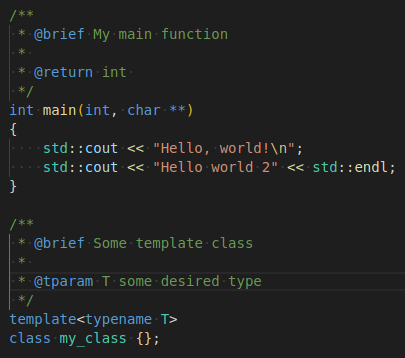
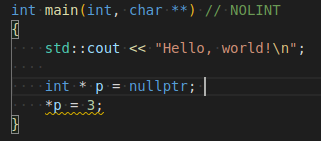
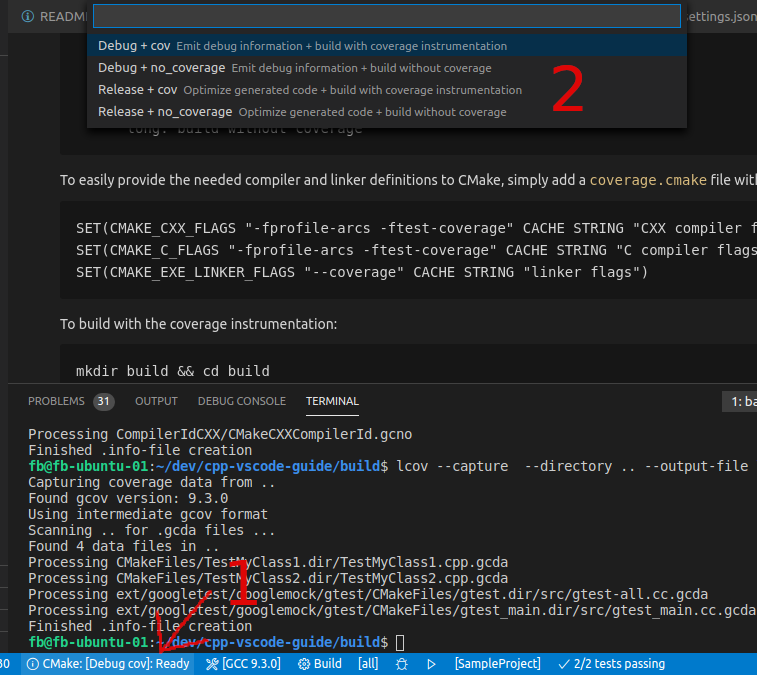

# cpp-vscode-guide <!-- omit in toc -->
A small guide for useful extensions to unleash the power of Visual Studio Code for C/C++ development. And damn, it's becoming better and better!

## Table of contents <!-- omit in toc -->

- [About the project](#about-the-project)
- [C/C++ Extension](#cc-extension)
- [GitHub integration](#github-integration)
- [Build system](#build-system)
  - [CMake](#cmake)
    - [Microsoft CMake Tools](#microsoft-cmake-tools)
    - [Support for writing CMake files](#support-for-writing-cmake-files)
- [Docker](#docker)
  - [Docker extension](#docker-extension)
  - [VS Code Remote Containers](#vs-code-remote-containers)
- [Documentation](#documentation)
  - [doxygen](#doxygen)
  - [Markdown](#markdown)
- [Remote development](#remote-development)
  - [Remote SSH Extension](#remote-ssh-extension)
- [Static analysis](#static-analysis)
  - [clang-tidy](#clang-tidy)
- [Testing](#testing)
  - [Test Explorer UI](#test-explorer-ui)
  - [C++ TestMate](#c-testmate)
- [Code Coverage](#code-coverage)
  - [Extension](#extension)
  - [Setup coverage for CMake](#setup-coverage-for-cmake)
  - [Using lcov to generate coverage info file](#using-lcov-to-generate-coverage-info-file)
- [Integrate sanitizers](#integrate-sanitizers)
  - [Address Sanitizer](#address-sanitizer)
  - [Memory Sanitizer](#memory-sanitizer)
  - [UndefinedBehavior Sanitizer](#undefinedbehavior-sanitizer)
  - [Thread Sanitizer](#thread-sanitizer)
- [Formatting](#formatting)
  - [clang-format](#clang-format)
- [Other nice little extensions](#other-nice-little-extensions)
  - [Bracket Pair Colorizer](#bracket-pair-colorizer)
  - [Todo Tree](#todo-tree)
  - [YAML](#yaml)
- [Some shortcuts and features](#some-shortcuts-and-features)
  - [Official VS Code shortcut cheat sheet](#official-vs-code-shortcut-cheat-sheet)
  - [Column selection mode](#column-selection-mode)
- [References](#references)

---

## About the project

This project should give an overview over some extensions and hints for C/C++ development with VS Code. There are a lot extensions around that really improve working with VCS. I want to show which of these are really valuable and give some tutorial how to use/integrate them.

---

## C/C++ Extension

First of all you need the official Microsoft C/C++ extension found [here](https://marketplace.visualstudio.com/items?itemName=ms-vscode.cpptools).

---

## GitHub integration

For personal development, GitHub is a good resource for projects and a good point to store your project at. So the GitHub plugin (found [here](https://marketplace.visualstudio.com/items?itemName=GitHub.vscode-pull-request-github)) supports you working with issues and pull requests.

For more details of the plugin see [https://code.visualstudio.com/docs/editor/github](https://code.visualstudio.com/docs/editor/github).

---

## Build system

### CMake

Some nice tools to help you with CMake projects.

---

#### Microsoft CMake Tools

To interact with CMake, the CMake Tools extension is there. It could be found [here](https://marketplace.visualstudio.com/items?itemName=ms-vscode.cmake-tools).

Especially the the CMake Quickstart feature, usable with the command palette (`Ctrl+Shift+P`) running **CMake: Quickstart**, is pretty nice to starting coding right away.

---

#### Support for writing CMake files

For support of writing CMakeLists files, the [CMake extension](https://marketplace.visualstudio.com/items?itemName=twxs.cmake) is pretty useful.

---

## Docker

### Docker extension

The [docker extension](https://marketplace.visualstudio.com/items?itemName=ms-azuretools.vscode-docker) gives you a good insight on the current images on the system and helps you to build and manage containers.

For installing docker, see [https://docs.docker.com/get-docker/](https://docs.docker.com/get-docker/).

---

### VS Code Remote Containers

Developing in a container! The [VS Code Remote Containers extension](https://marketplace.visualstudio.com/items?itemName=ms-vscode-remote.remote-containers) lets you use a docker container as development environment. No more installing toolchains and dependencies! Simply write a Dockerfile and share the development environment with others and use it simply with a click out of VS Code. 

After installation map your development folder via the command palette (`Ctrl+Shift+P`), selecting **Remote-Containers: Open Folder in Container** to a specified docker container.

See the `.devcontainer/devcontainer.json` settings file for details. It refers to the container description in `examples/Dockerfile`.

For more details, see [https://github.com/Microsoft/vscode-dev-containers](https://github.com/Microsoft/vscode-dev-containers).

---

## Documentation

### doxygen 

Adding doxygen language support could be done by installing the [doxygen extension](https://marketplace.visualstudio.com/items?itemName=bbenoist.Doxygen).

To support you with automated comment templates in your code, the [Doxygen Documentation Generator](https://marketplace.visualstudio.com/items?itemName=cschlosser.doxdocgen) is very useful.

To install doxygen: 

    apt install doxygen

For enhanced visualization in doxygen, install graphviz.

    apt install graphviz
    
If you like easy visualization of customizable sequence charts, maybe mscgen is the right thing for you. You can install it with:

    apt install mscgen

To run doxygen from VS Code, the [Doxygen Runner extension](https://marketplace.visualstudio.com/items?itemName=betwo.vscode-doxygen-runner) is helpful.

Simply install the extension, add a `Doxyfile` to your workspace folder (e.g. with `doxygen -g`) and change the `settings.json` accordingly.

    "doxygen_runner.configuration_file_override": "${workspaceFolder}/Doxyfile"

Finally you can start doxygen via the command palette (`Ctrl+Shift+P`), selecting **Generate Doxygen generation**.

### Markdown

There are several markdown related extensions available. But currently a very nice one is [Markdown All in One](https://marketplace.visualstudio.com/items?itemName=yzhang.markdown-all-in-one#table-of-contents). It supports shortcuts, automated creation of TOCs and many more. 

---

## Remote development

### Remote SSH Extension

If you are developing for remotely connected devices (e.g. RPi), the [Remote - SSH](https://marketplace.visualstudio.com/items?itemName=ms-vscode-remote.remote-ssh) extension saves a lot of time. It enables you to work with VS Code like you are used to work locally. The communication is done via SSH. So also autlogin via certificates is possible.  

---

## Static analysis

### clang-tidy

**Doing a static analysis on the fly during your coding session without any additional effort!**

The curly underlined statement was discovered by clang-tidy to be problematic (assign to nullptr).

Installing clang-tidy: 

    apt install clang-tidy

Install the following extension for VS Code

https://marketplace.visualstudio.com/items?itemName=notskm.clang-tidy
    
Add to your settings.json:

    "clang-tidy.checks": [
        "bugprone-",
        "cert-",
        "clang-analyzer-",
        "cppcoreguidelines-",
        "-cppcoreguidelines-pro-type-vararg",
        "-cppcoreguidelines-pro-bounds-array-to-pointer-decay",
        "llvm-",
        "-llvm-include-order",
        "misc-",
        "modernize-",
        "-modernize-use-trailing-return-type",
        "-modernize-concat-nested-namespaces",
        "performance-",
        "readability-*"
        ],

        "clang-tidy.compilerArgs" : [ "-std=c++11" ], 
        "clang-tidy.buildPath" : "build", 
        "clang-tidy.executable" : "clang-tidy"    

Enable/disable the checks you need accordingly. Also configure your compiler arguments.

To avoid linting of "special" code:

    some_code_that_should_be_excluded_from_linting(); // NOLINT or /* NOLINT */

---

## Testing

### Test Explorer UI

The [Test Explorer UI](https://marketplace.visualstudio.com/items?itemName=hbenl.vscode-test-explorer) provides a extensible UI to run your tests in VS Code. There are multiple adapters for different test frameworks available.

---

### C++ TestMate

The [C++ TestMate Extension](https://marketplace.visualstudio.com/items?itemName=matepek.vscode-catch2-test-adapter) allows you to run your GoogleTest, Catch2 and other test framework unittests with the Test Explorer UI.

---

## Code Coverage

### Extension

[This](https://marketplace.visualstudio.com/items?itemName=markis.code-coverage) extension helps you to get some coverage information from your tests based on data generated by lcov.

### Setup coverage for CMake

Compile your application/tests with `-fprofile-arcs -ftest-coverage`. For linking the `--coverage` flag is needed.

An easy way to propagate these flags to CMake ist the use of the `.vscode/cmake-variants.yaml`. 
There you can set different variants of your toolchain. Below you can see an example for adding coverage instrumentation with compiler flags:

    buildType:
      default: debug
      choices:
        debug:
          short: Debug
          long: Emit debug information
          buildType: Debug
        release:
          short: Release
          long: Optimize generated code
          buildType: Release

    coverage:
      default: no_coverage
      choices:
        # enable coverage by additional compiler flags
        coverage:
          short: cov
          long: build with coverage instrumentation
          settings:
            CMAKE_CXX_FLAGS: "-fprofile-arcs -ftest-coverage "
            CMAKE_C_FLAGS: "-fprofile-arcs -ftest-coverage"
            CMAKE_EXE_LINKER_FLAGS: "--coverage"
        no_coverage:
          short: no_coverage
          long: build without coverage

After changing the `cmake-variants.json`, you can choose a build variant (click 1 and select in 2) as shown in the screenshot. Alternatively you can open the command palette (`Ctrl+Shift+P`) and run **CMake: Select Variant**.

### Using lcov to generate coverage info file

Install lcov:

    apt install lcov
    
Running `lcov` in your build directory **before** running the tests:

    lcov --no-external --capture --initial --directory .. --output-file lcov.info
    
Running `lcov` in your build directory **after** running the tests:

    lcov --no-external --capture --directory .. --output-file lcov.info
    
Add path to your info file in VS Code `settings.json` 
    
    "markiscodecoverage.searchCriteria": "<build path>/lcov.info"
    
TODO: How to add to VS Code launch and CMake?

---

## Integrate sanitizers

With the use of `cmake-variants.yaml` it's pretty easy to add different sanitizer options to your build process. 

Initially you can add a sanitizer section to your `cmake-variants.yaml` that contains a no-sanitizer configuration:

    sanitizer:
      default: NoSan # no sanitizer
      choices:
        NoSan:
          short: NoSan
          long: build without adresss sanitizer instrumentation

The following subsections show the use of the clang sanitizers. Simply add the configuration to the `sanitizer` section described above within the `cmake-variants.yaml`.

---

### Address Sanitizer

The address sanitizer helps you to detect out-of-bound memory access, use-after-free, double frees, etc. To use the clang address sanitizer add the following snippet to the sanitizer section of the `cmake-variants.yaml`.

    ...
    choices: 
    ...
      ASan:
        short: ASan
        long: build with adresss sanitizer instrumentation
        settings:
          CMAKE_CXX_FLAGS: "-fsanitize=address -fno-omit-frame-pointer"
          CMAKE_C_FLAGS: "-fsanitize=address -fno-omit-frame-pointer"
          CMAKE_EXE_LINKER_FLAGS: "-fsanitize=address"

For more details see [https://clang.llvm.org/docs/AddressSanitizer.html](https://clang.llvm.org/docs/AddressSanitizer.html).

The following sections are utilizing the clang sanitizers. Some of them also available for gcc.

---

### Memory Sanitizer

The memory sanitizer helps you to find uninitialized reads. 

    ...
    choices: 
    ...
      MSan:
        short: MSan
        long: build with memory sanitizer instrumentation
        settings:
          CMAKE_CXX_FLAGS: "-fsanitize=memory"
          CMAKE_C_FLAGS: "-fsanitize=memory"

For more details see [https://clang.llvm.org/docs/MemorySanitizer.html](https://clang.llvm.org/docs/MemorySanitizer.html).

---

### UndefinedBehavior Sanitizer

The undefined behavior sanitizer scans your code for occurence of undefined behavior. 

    ...
    choices: 
    ...
      UBSan:
        short: UBSan
        long: build with undefined behaviour sanitizer instrumentation
        settings:
          CMAKE_CXX_FLAGS: "-fsanitize=undefined"
          CMAKE_C_FLAGS: "-fsanitize=undefined"
          CMAKE_EXE_LINKER_FLAGS: "-fsanitize=undefined"

For more details see [https://clang.llvm.org/docs/UndefinedBehaviorSanitizer.html](https://clang.llvm.org/docs/UndefinedBehaviorSanitizer.html). 

For available checks see [https://clang.llvm.org/docs/UndefinedBehaviorSanitizer.html#ubsan-checks](https://clang.llvm.org/docs/UndefinedBehaviorSanitizer.html#ubsan-checks).

---

### Thread Sanitizer

The thread sanitizer helps you to detect data races.

    ...
    choices: 
    ...
      TSan:
        short: TSan
        long: build with thread sanitizer instrumentation
        settings:
          CMAKE_CXX_FLAGS: "-fsanitize=thread"
          CMAKE_C_FLAGS: "-fsanitize=thread"

[https://clang.llvm.org/docs/ThreadSanitizer.html](https://clang.llvm.org/docs/ThreadSanitizer.html)

---

## Formatting

### clang-format

Installing clang-format: 

    apt install clang-format

To use clang-format within VS Code, you need to install the [clang-format extension](https://marketplace.visualstudio.com/items?itemName=xaver.clang-format) and place a `.clang-format` within your workspace root directory.

To run the formatter, press `Ctrl+Shift+I`. Maybe you have to choose the right formatter on first usage. 

A sample `.clang-format` file could be found in the project root. 

---

## Other nice little extensions

### Bracket Pair Colorizer

[Bracket Pair Colorizer](https://marketplace.visualstudio.com/items?itemName=CoenraadS.bracket-pair-colorizer) adds different colors to brackets, so nested brackets could be distinguished much better.

---

### Todo Tree
[Todo Tree](https://marketplace.visualstudio.com/items?itemName=Gruntfuggly.todo-tree) shows all the todo tag within your files in a tree structure so you can easily have an eye on them. **TODO:** remove old image

---

### YAML
The [RedHat YAML Extension](https://marketplace.visualstudio.com/items?itemName=redhat.vscode-yaml) helps you writing YAML files with formatting and checking the file content.

- HexInspector

---

## Some shortcuts and features

### Official VS Code shortcut cheat sheet

The basic VS Code shortcuts can be found [here](https://code.visualstudio.com/shortcuts/keyboard-shortcuts-windows.pdf)

---

### Column selection mode

That is a really cool feature, especially for refactoring/renaming tasks. So don't miss to use it with opening the command palette (`Ctrl+Shift+P`) and run **Toggle column selection mode**.

---

## References

- More on CMake variants and CMake extension: [https://code.visualstudio.com/docs/cpp/cmake-linux#_select-a-variant](https://code.visualstudio.com/docs/cpp/cmake-linux#_select-a-variantctrl)
- CTest: [https://cmake.org/cmake/help/latest/manual/ctest.1.html](https://cmake.org/cmake/help/latest/manual/ctest.1.html)
- Working with containers in VS Code: [https://code.visualstudio.com/docs/containers/overview](https://code.visualstudio.com/docs/containers/overview)
