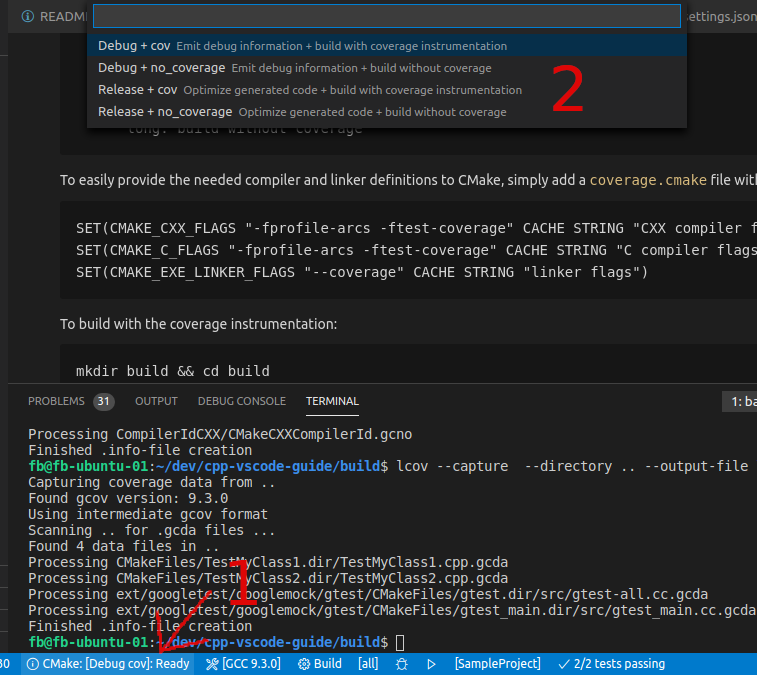

# Code coverage <!-- omit in toc -->

## Table of contents <!-- omit in toc -->

- [Overview](#overview)
- [Setup coverage for CMake builds](#setup-coverage-for-cmake-builds)
- [Using lcov to generate coverage info file](#using-lcov-to-generate-coverage-info-file)
- [Automate coverage extraction with tasks](#automate-coverage-extraction-with-tasks)
- [Extension](#extension)
- [References](#references)

---

## Overview

This documentation shows how to configure and evaluate the code coverage of your application under Linux with lcov.

---

## Setup coverage for CMake builds

Compile your application/tests with `-fprofile-arcs -ftest-coverage`. For linking the `--coverage` flag is needed.

An easy way to propagate these flags to CMake ist the use of the `.vscode/cmake-variants.yaml`.
There you can set different variants of your toolchain. Below you can see an example for adding coverage instrumentation with compiler flags:

    buildType:
      default: debug
      choices:
        debug:
          short: Debug
          long: Emit debug information
          buildType: Debug
        release:
          short: Release
          long: Optimize generated code
          buildType: Release

    coverage:
      default: no_coverage
      choices:
        # enable coverage by additional compiler flags
        coverage:
          short: cov
          long: build with coverage instrumentation
          settings:
            CMAKE_CXX_FLAGS: "-fprofile-arcs -ftest-coverage "
            CMAKE_C_FLAGS: "-fprofile-arcs -ftest-coverage"
            CMAKE_EXE_LINKER_FLAGS: "--coverage"
        no_coverage:
          short: no_coverage
          long: build without coverage

After changing the `cmake-variants.yaml`, you can choose a build variant (click 1 and select in 2) as shown in the screenshot. Alternatively you can open the command palette (`Ctrl+Shift+P`) and run **CMake: Select Variant**. Afterwards reconfiguring your project might be necessary. This could be done via the command palette, running **CMake: Configure**.

More about `cmake-variants.yaml` in the [About CMake variants](../README.md#about-cmake-variants) section.

---

## Using lcov to generate coverage info file

1. Running `lcov` in your workspace directory **before** running the tests:

        lcov --no-external --capture --initial --directory . --output-file lcov_base.info

    This is necessary to also get the data of the source files that are not covered by any test!

2. Running `lcov` in your workspace directory **after** running the tests:

        lcov --no-external --capture --directory . --output-file lcov.info

3. Merging the baseline and the test coverage file within your workspace folder:

        lcov --add-tracefile lcov_base.info --add-tracefile lcov.info --output-file lcov.info

4. To filter out unwanted results (e.g. STL headers and externals), use:

        lcov --remove lcov.info '/usr/*' '*/googletest/*' --output-file lcov.info

5. Finally you can run genhtml to generate a HTML coverage report at a specified location:

        genhtml lcov.info -o <your report folder>

## Automate coverage extraction with tasks

A powerful tool, to automate the commands that have to be executed for coverage generation and extraction into HTML, are tasks.

Some sample how to run lcov and filter unwanted results afterwards.

    {
        "version": "2.0.0",
        "tasks": [
       {
            "label": "lcov",
            "type": "shell",
            "command": "lcov",
            "options": {
                "cwd": "${workspaceFolder}"
            },
            "args": [
                "--capture",
                "--directory",
                ".",
                "--output-file",
                "lcov.info"
            ]
        }] 
    }

See the `.vscode/tasks.json` for a more detailed example that runs lcov, filters the result, runs genhtml to generate a HTML report and finally starts firefox to display it.
The build/scan folders and the browser should be configured to match your setup.

**The steps are only working if you use a GCC compiler with the according instrumentation!**

To run the tasks, open the command palette (`Ctrl+Shift+P`) and run **Tasks: Run Task**. A nice alternative to that is the use of an extension like [Task Explorer](https://marketplace.visualstudio.com/items?itemName=spmeesseman.vscode-taskexplorer) that helps you to show and manage the tasks.

The sample workflow shown in `tasks.json` to generate a coverage report is:

1. Command palette (`Ctrl+Shift+P`) -> **CMake: Clear Rebuild**
2. Command palette (`Ctrl+Shift+P`) -> **Tasks: Run Task** -> **Coverage: create baseline**
3. Run your tests
4. Command palette (`Ctrl+Shift+P`) -> **Tasks: Run Task** -> **Coverage: generate report & open in browser**

    A popup will ask you for the destination folder of the report.

<!-- TODO: More about tasks in Tasks section -->

---

## Extension

The [Coverage Gutters](https://marketplace.visualstudio.com/items?itemName=ryanluker.vscode-coverage-gutters) extension uses the coverage information created by lcov to display the code coverage of a source file opened in the editor. The configuration is quite simple. If you're using the coverage creation workflow from the tasks, simply add the following line to `settings.json`.

    "coverage-gutters.coverageFileNames": [ "lcov.info" ]

To finally display the coverage (green means covered statement, red un-covered), run the **Coverage:: combine baseline** task after execution of your tests and use the command palette (`Ctrl+Shift+P`) and run **Coverage Gutters: Display Coverage**.

## References

- General lcov documentation and examples: [https://wiki.documentfoundation.org/Development/Lcov](https://wiki.documentfoundation.org/Development/Lcov)
- Show source files that are not executed: [https://stackoverflow.com/questions/44203156/can-lcov-genhtml-show-files-that-were-never-executed](https://stackoverflow.com/questions/44203156/can-lcov-genhtml-show-files-that-were-never-executed)
