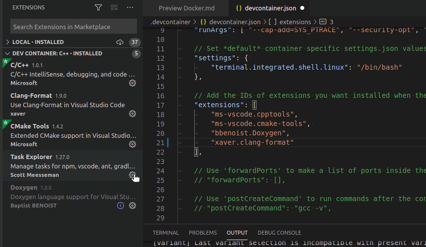

# Docker integration & extension <!-- omit in toc -->

## Table of contents <!-- omit in toc -->

- [Overview](#overview)
- [Docker extension](#docker-extension)
- [VS Code Remote Containers](#vs-code-remote-containers)
- [Using docker of a remote machine](#using-docker-of-a-remote-machine)
- [References](#references)

---

## Overview

Tools that support you managing and maintaining docker images or building your project directly within a container.

---

## Docker extension

The [docker extension](https://marketplace.visualstudio.com/items?itemName=ms-azuretools.vscode-docker) gives you a good insight on the current images on the system and helps you to build and manage containers. Also running the images is pretty easy that way. Furthermore it shows you the volumes, networks and registries used by docker.

For installing docker, see [https://docs.docker.com/get-docker/](https://docs.docker.com/get-docker/).

---

## VS Code Remote Containers

Developing in a container! The [VS Code Remote Containers extension](https://marketplace.visualstudio.com/items?itemName=ms-vscode-remote.remote-containers) lets you use a docker container as development environment. No more installing toolchains and dependencies! Simply write a Dockerfile and share the development environment with others and use it simply with a click out of VS Code.

<!--  -->

After installation map your development folder via the command palette (`Ctrl+Shift+P`), selecting **Remote-Containers: Open Folder in Container** to a specified docker container.

See the `.devcontainer/devcontainer.json` settings file for details. It refers to the container description in `examples/Dockerfile`.

Extensions must be installed separately within the container. To automate this, you could edit the `extensions` array within your `.devcontainer/devcontainer.json` configuration and add the corresponding extension id or use the `Add to devcontainer.json` feature.

## Using docker of a remote machine

I nice feature to utilize the containerd service of a remote machine is the use of a different docker context. This is usefull if you dont't have the necessary resources (CPU, RAM, etc.) on your own machine and can speed up compiling a lot (e.g. WSL vs. native Linux).

To add a new context simply do

    docker context create <context name> --docker "host=ssh://username@host:port"

Use the command palette (`Ctrl+Shift+P`) and select **Docker Context: Use**  to activate the newly created context.

Now you're able to see the docker data of the remote machine via the docker extension.

To start developing on the remote container, simply run **Remote Containers: Clone Repository in Container Volume**. It'll ask you for a git repository that it clones into the container.

The instance will use a `devcontainer.json` configuration and adds all extensions and settings accordingly.

## References

- Details on development containers: [https://github.com/Microsoft/vscode-dev-containers](https://github.com/Microsoft/vscode-dev-containers).
- Advanced container related topics: [https://code.visualstudio.com/docs/remote/containers-advanced](https://code.visualstudio.com/docs/remote/containers-advanced)
- Connect to remote Docker over SSH: [https://code.visualstudio.com/docs/containers/ssh](https://code.visualstudio.com/docs/containers/ssh)
