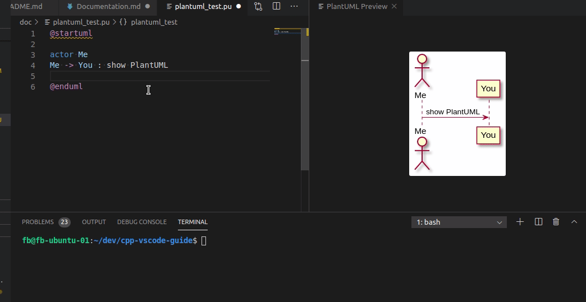

# Documentation with VS Code <!-- omit in toc -->

## Table of contents <!-- omit in toc -->

- [Overview](#overview)
- [doxygen](#doxygen)
- [Markdown](#markdown)
- [PlantUML](#plantuml)
- [References](#references)

---

## Overview

This document shows how to enhance your documentation capabilities with VS Code.

---

## doxygen

Adding doxygen language support could be done by installing the [doxygen extension](https://marketplace.visualstudio.com/items?itemName=bbenoist.Doxygen).

To support you with automated comment templates in your code, the [Doxygen Documentation Generator](https://marketplace.visualstudio.com/items?itemName=cschlosser.doxdocgen) is very useful.

To install doxygen:

    apt install doxygen

For enhanced visualization in doxygen, install graphviz.

    apt install graphviz

To run doxygen from VS Code, the [Doxygen Runner extension](https://marketplace.visualstudio.com/items?itemName=betwo.vscode-doxygen-runner) is helpful.

Simply install the extension, add a `Doxyfile` to your workspace folder (e.g. with `doxygen -g`) and change the `settings.json` accordingly.

    "doxygen_runner.configuration_file_override": "${workspaceFolder}/Doxyfile"

Finally you can start doxygen via the command palette (`Ctrl+Shift+P`), selecting **Generate Doxygen documentation**.

---

## Markdown

There are several markdown related extensions available. But currently a very nice one is [Markdown All in One](https://marketplace.visualstudio.com/items?itemName=yzhang.markdown-all-in-one#table-of-contents). It supports shortcuts, automated creation of TOCs and many more.

---

## PlantUML

If you like to enrich your documentation with nice UML diagrams, the [PlantUML](https://marketplace.visualstudio.com/items?itemName=jebbs.plantuml) extension is the right choice. It supports you with syntax highlighting of plantUML files and a very cool preview windows that displays your diagrams during creation. To show the preview on a pure plantUML file or embedded within doxygen/markdown use the command palette (`Ctrl+Shift+P`) and run  **PlantUML: Preview Current Diagram**. The diagrams could also be exported in various formats.

As mentioned, it could also be integrated with doxygen. The diagrams are automatically generated and included in your documentation then.

---

## References

- Official Doxygen site: [https://www.doxygen.nl/index.html](https://www.doxygen.nl/index.html)
- PlantUML Website: [https://plantuml.com](https://plantuml.com)
