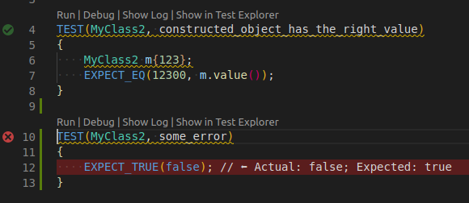

# Testing <!-- omit in toc -->

## Table of contents <!-- omit in toc -->

- [Overview](#overview)
- [Test Explorer UI](#test-explorer-ui)
- [C++ TestMate](#c-testmate)
- [References](#references)

---

## Overview

Some information about general testing with VS Code and testing extensions.

---

## Test Explorer UI

The [Test Explorer UI](https://marketplace.visualstudio.com/items?itemName=hbenl.vscode-test-explorer) provides a extensible UI to run your tests in VS Code. There are multiple adapters for different test frameworks available.

To support your used test framework, an according test adapter has to be installed. I found the C++ TestMate extension pretty valuable for that.

The test section can be found in the Activity Bar and is represented by a test tube icon.

---

## C++ TestMate

The [C++ TestMate Extension](https://marketplace.visualstudio.com/items?itemName=matepek.vscode-catch2-test-adapter) allows you to run your GoogleTest, Catch2 and other test framework unittests with the Test Explorer UI.

A very nice feature is the debugging capability of the extension. If a certain test fails, you just have to navigate to the desired test case and click at the `Debug this test` button. So you can easily debug the single tests without the need of creating a separate launch configuration.

When activating CodeLens within `settings.json` by adding `"testExplorer.codeLens": true`, you get a very nice annotation on succeeding and failing tests. Also selection and running out of the editor itself is possible with it.

If you need special settings for a test you can also customize this (e.g. certain random seed, other args, etc.).

**Currently the extension has it's CodeLens features for googletest only available if you're using googletest 1.8.0 or above!**

## References

- Testing framework googletest: [https://github.com/google/googletest](https://github.com/google/googletest)
- Testing framework Catch2: [https://github.com/catchorg/Catch2](https://github.com/catchorg/Catch2)
